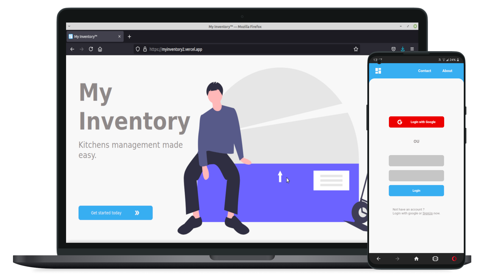

<h1 align="center">&nbsp;&nbsp;My Inventory</h1>
<h3>v2.0</h3>
<p align="center">
    
</p>

## Summary

- [What is it?](#what-is-it)
- [Development Status](#development-staus)
- [Features](#what-is-it)
- [Technologies Embed](#tecnologies-embed)
- [Tools Used](#tools-used)
- [How to Run](#how-to-run)
- [Contact](#contact-the-dev)
- [Licensing](#licensing)

## What is it?
An app to handle and manage inventory and/or kitchens.

## Development Status

Project currently under development;

## Features

- Store and manage product data, such as quantities and expirations;
- Show what's expirating on, expired products may no longer be visible for user(coming soon);
- Data storage on Firebase Realtime Database;
- PWA version coming soon, or not so soon rs.

## Teconolgies embed

- HTML 5  - [See more](https://developer.mozilla.org/pt-BR/docs/Web/HTML/HTML5)
>>
- SASS  - [See more](https://sass-lang.com/)
>>
- Material UI - [See more](https://material-ui.com/)
>>
- ReactJS  - [See more](https://reactjs.org/)

## Tools used

- Figma - [see](https://www.figma.com/)
- Visual Studio Code - [see](https://code.visualstudio.com/)

## How to run

First create a folder with a name of your choice, then clone this repo:

- Via SSH:
```bash
$ git clone git@github.com:xSallus/my-inventory.git
```

- Via HTTPS:
```bash
$ git clone https://github.com/xSallus/my-inventory.git
```

Then, add all the dependencies, on each folder run:

```bash
$ yarn
```

Then, for web version, run the development server:

```bash
yarn dev
```

Finally, open ```'http://localhost:3000'``` with your browser to see the result.

And for mobile version, run the expo application and...
[coming soon...]

## Known bugs

- None right now :D

## Contact the Dev

- [Github&nbsp;&nbsp;](https://github.com/xSallus)
- [Linkedin&nbsp;&nbsp;](https://linkedin.com/in/salomao-vasconcelos)

## Licensing
 Licensed under MIT License,&nbsp;&nbsp;[see more](LICENSE.md);

You can take a look at the live project [here](https://myinventory2.vercel.app/).

2021, xSallus&copy;.
