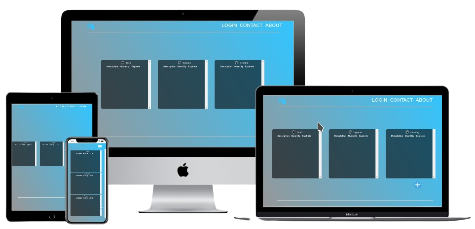

<h1 align="center">&nbsp;&nbsp;MyInventory</h1>



## Sumary

- [What is it?](#what-is-it)
- [Development Status](#development-staus)
- [Features](#what-is-it)
- [Tecnologies Embed](#tecnologies-embed)
- [Tools Used](#tools-used)
- [How to Run](#how-to-run)
- [Contact](#contact-the-dev)
- [Licensing](#licensing)

## What is it?
An app to handle and manage inventory and/or kitchens.

## Development Status

Project currently under development;

## Features

- Store and manage product data, such as quantities and expirations;
- Show what's expirating on, expired products may no longer be visible for user;
- Local and cloud(comming soon) data storage (storage currently not working);

## Teconolgies embed

- HTML 5  - [See more](https://developer.mozilla.org/pt-BR/docs/Web/HTML/HTML5)
>>
- CSS Modules  - [See more](https://github.com/css-modules/css-modules)
>>
- ReactJS  - [See more](https://reactjs.org/docs/getting-started.html)
>>
- ReactNative  - [See more](https:/reactnative.dev)
>>
- NextJS  - [See more](https://nextjs.org/docs)
>>
- Expo  - [See more](https://nextjs.org/docs)

## Tools used

- Figma - [see](https://www.figma.com/)
- Visual Studio Code - [see](https://code.visualstudio.com/)
- ExpoGO - [Android](https://play.google.com/store/apps/details?id=host.exp.exponent&hl=pt_BR&gl=US) / [iOS](https://apps.apple.com/br/app/expo-go/id982107779)

## How to run

First create a folder with a name of your choice, then clone this repo:

- Via SSH:
```bash
git clone git@github.com:xSallus/MyInventory.git
```

- Via HTTPS:
```bash
git clone https://github.com/xSallus/MyInventory.git
```

Then, add all the dependencies, on each folder run:

```bash
yarn add
```

Then, for web version, run the development server:

```bash
yarn dev
```

Finally, open ```'http://localhost:3000'``` with your browser to see the result.

And for mobile version, run the expo aplication and...
[coming soon...]

## Known bugs

- When a product is added, thhe function that handles its remove is calls itself.</br>[Status: Not fixed]

## Contact the Dev

- [Github&nbsp;&nbsp;](https://github.com/xSallus)
- [Instagram&nbsp;&nbsp;](https://instagram.com/xsallus.dev)
- [Twitter&nbsp;&nbsp;](https://twitter.com/xSallus_dev)
- [Linkedin&nbsp;&nbsp;](https://linkedin.com/in/salomao-vasconcelos)
- [Behance&nbsp;&nbsp;](https://behance.com/salomaosouza)

## Licensing
 Licensed under MIT License, [see more](./Licensing.md);

<p align="center">2021, xSallus&copy;</p>
